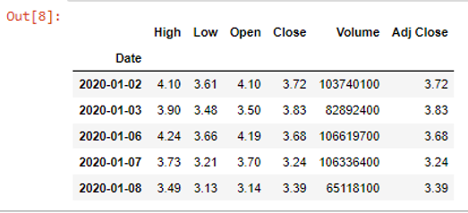
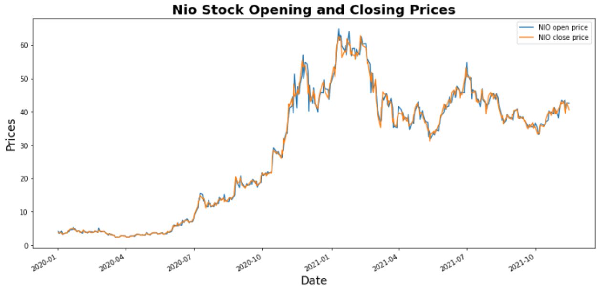
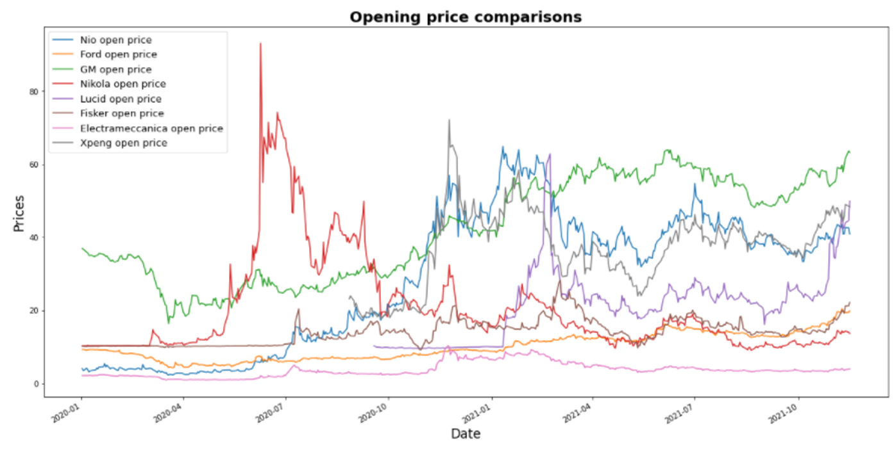
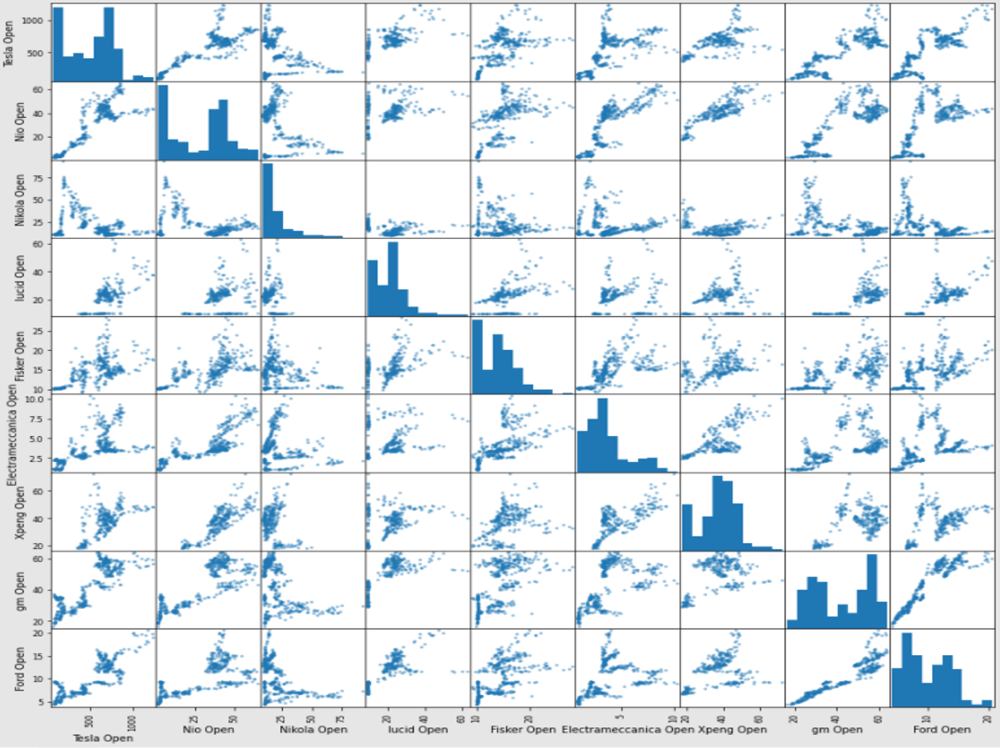
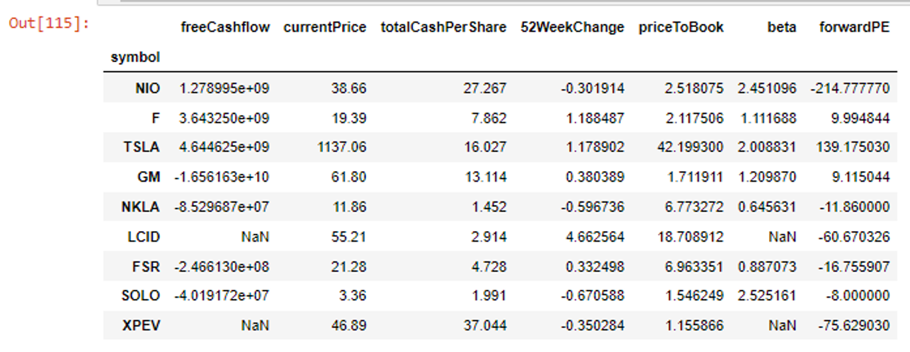
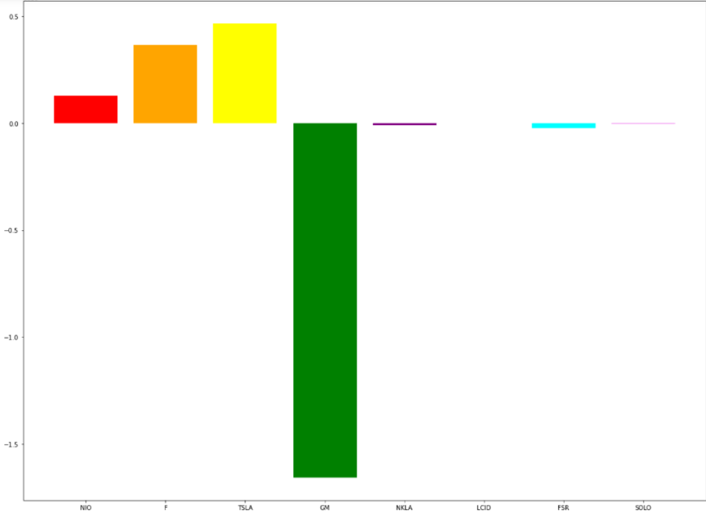

I recently sold stock I owned in Ford which had appreciated over 100% in value over the last year. I was thinking to put those gains towards stock in a company engaged in the manufacture of Electric Vehicles (EVs). The inspiration for this came from my Energy Law class in which we discussed the future phase out of gas powered engines. **Dozens of national governments have already pledged towards phasing out sales of new gasoline and diesel-powered vehicles within the next 10-15 years. This is a clear signal that EV companies would be a great asset to buy and hold.** I figured I would do this analysis in python given the versatility of this programming language and its popularity. 

Having learned the fundamentals of programming in R, the overall concepts were easily translatable to Python. I installed the necessary packages (pandas-datareader, matplotlib and yfinance). I will outline my analysis in steps.

# 1- Importing packages and initial testing

```
import pandas_datareader.data as web
import datetime
import numpy

start = datetime.datetime(2020,1,1)
end = datetime.datetime(2021,11,15)

NIO = web.DataReader("NIO",'yahoo', start, end)

NIO.head()
```


 I used pandas data reader and set parameters in my request asking for stock info from yahoo for NIO with start and end dates.Thereafter, I made a simple plot of the opening and closing prices for NIO.
 
 ```
 import matplotlib as plt
NIO['Open'].plot(label = "NIO open price", figsize=(15,7))
NIO['Close'].plot(label = "NIO close price")
plt.pyplot.legend()
plt.pyplot.title('Nio Stock Opening and Closing Prices', fontsize=20, weight='bold')
plt.pyplot.xlabel('Date', fontsize=17)
plt.pyplot.ylabel('Prices', fontsize=17)
 ```
 
 
 
 
  With this I was learning the basic syntax of plotting using matplotlib. As expected opening and closing prices are closely correlated.
 
 # 2- Open Price Comparisons
 
 Below are the nine companies I am examining, I tried to choose the most visible companies in this sector. I requested data for all from the beginning of 2020 until now.
 
 ```
 start = datetime.datetime(2020,1,1)
end = datetime.datetime(2021,11,16)

nio = web.DataReader("NIO",'yahoo', start, end)
ford = web.DataReader("F",'yahoo', start, end)
tesla = web.DataReader("TSLA",'yahoo', start, end)
gm = web.DataReader("GM",'yahoo', start, end)
nikola = web.DataReader("NKLA",'yahoo', start, end)
lucid = web.DataReader("LCID",'yahoo', start, end)
fisker = web.DataReader("FSR",'yahoo', start, end)
electrameccanica = web.DataReader("SOLO",'yahoo', start, end)
xpeng = web.DataReader("XPEV",'yahoo', start, end)
```

I then plotted the opening prices of all to get an understanding of how volatile each stock is in relation to the rest.

```
nio['Open'].plot(label= "Nio open price",figsize=(20,10))
ford['Open'].plot(label = "Ford open price",figsize=(20,10))
#tesla['Open'].plot(label = "TESLA open price")
gm['Open'].plot(label = "GM open price")
nikola['Open'].plot(label = "Nikola open price")
lucid['Open'].plot(label = "Lucid open price")
fisker['Open'].plot(label = "Fisker open price")
electrameccanica['Open'].plot(label = "Electrameccanica open price")
xpeng['Open'].plot(label = "Xpeng open price")
plt.pyplot.legend(prop={'size':13})
plt.pyplot.xlabel('Date', fontsize=17)
plt.pyplot.ylabel('Prices', fontsize=17)
```



An important thing to note is that I viewed the data as a whole but then **put Tesla in comments as it is trading in the range of +$1,000 and seriously distorted the chart. I found myself doing this throughout this analysis which is evidence that Tesla is much more mature than the rest of these companies**, it is also much more established. There are a few additional take-aways here:

* as expected **GM and Ford were the most stable stock, trading within a narrow range throughout the year**. Shockingly, electrameccanica traded at stable prices over the last year.

* **Nikola experienced the biggest price drop among all companies in July 2020.** Apparently, one of their prototypes was not functional, and apparently false claims were made by the company in regards to orders, battery development, and hydrogen production. This is a pretty big red flag.

* **Nio experienced pretty healthy growth over the last year.** In large part driven by a boom in sales, primarily in China where the company is based. 

* Lucid exploded in price around March 2021 before coming back down ( a sign of volatility)

# 3-Scatter Matrix and Correlation

I now wanted to test another hypothesis of whether these stocks are closely correlated to each other or not. **My hypothesis is that we would see strong correlation between these stocks as they are all in the same sector**. However, I was surprised to see little correlation in terms of opening prices among these companies.



High correlation exists where the data points come together to form a straight line, but as is evident here there is very weak correlation in regards to these companies. The closest the data comes to making a straight line is the case of GM and Ford, but even then correlation looks fairly weak.

The important lesson learned here as is that **these companies stock prices do not move together**, rather each company operates as if it is in another industry completely. This highlights the importance of picking the right company(companies) and the **inability to hope that increased demand for EV's will bring all EV stocks to higher prices.**


# 4- Fundamental Analysis

In this next section I wanted to zoom in on some of the more well-known metrics used to measure companies based on earnings, sales, book value, etc.

```
tickers = ['NIO','F','TSLA','GM', 'NKLA', 'LCID', 'FSR', 'SOLO','XPEV']

metrics = []

for i in tickers:
    metrics.append(yf.Ticker(i).info)

```

Here I defined a list (tickers) wherein I will compare the 9 companies I am interested in. I also defined the metrics I will look at by creating a for loop that will append all the info on these companies available in yahoo finance.

```
import pandas as pd
df = pd.DataFrame(metrics)
df= df.set_index('symbol')

fundamentals = ['currentPrice','ebidta','debttoEquity','totalCashPerShare','52WeekChange','priceToBook','freeCashflow','forwardPE','beta']

df[df.columns[df.columns.isin(fundamentals)]]
```

Now I created a database containing all company info, and I set the symbol as the index, making it easier to identify the stocks.I then selected the relevant pieces of information that I am interested in. I then created another data frame filtered for the fundamentals in which I was interested. 



And lastly, to visualize this data, we need to create a plot

```
import matplotlib.pyplot as plt

plt.bar(df.index, df.freeCashflow, color = ('red', 'orange', 'yellow', 'green', 'purple', 'blue','cyan','violet','gray'))
plt.rcParams["figure.figsize"] = (20,15)
plt.show()

```

In this case, I am displaying free cash flow, and when I want to visualize other aspects, I can simply replace df.feeCashflow wit the other fundamentals.



After visualizing different aspects of the data table, I gained some pretty important insights:

* **With the exceptions of TSLA, Ford and GM, all other companies have negative forward PE ratios. Meaning that these companies all have negative earnings and will have negative earnings into the future.** I came to expect this after going through some of the data above, it became clear early on in this project that all of these companies are still in their infancies, but I was surprised to see this be the case across all companies except for the established 3 (GM, Ford, Tesla).

* Beta is a measure of volatility, a beta of more than 1.0 is an indication of more volatility than the market and less than one a measure of being less volatile. **By this measure, Nio, Tesla and Electrameccanica are the most volatile stocks.** Looking at this with the 52 week change column, we see that **in the case of Nio and Electrameccanica, that volatility was negative given the decline in stock value and in the case of Tesla, positive volatility as Tesla gained over 90% in the last year.**

* In terms of Price to Book Ratio, **the outlier here is Tesla which is trading at 40x its book value, an indication that the stock is very popular and possibly overvalued**. All other stocks are trading at a book value of 1-2.

* Total cash per share was very interesting. **Xpeng has a cash per share of 37, more than double that of Tesla!** However, **it is also in negative free cash flow territory**, The results here do not show that, but upon research in other sources that is what I found. **This negative free cash flow is the case with the other non-established companies being compared as well, with the exception of NIO, which is cash flow positive.** This is expected given the infant stage in which these companies are currently in.

* Overall, **all of these stocks look very volatile and none is a clear winner in terms of financial fundamentals. Unlike the large automakers, these companies are for the most part, not yet making money and are still in the start-up stage.** However, I still have no doubts that EVs are the future and there will be major winners. **Beyond the numbers, What I like about Xpeng is that it also has the backing of AliBaba and the Qatari and UAE sovereign wealth funds. It is currently selling cars in China and abroad, in addition to certain financial points that are encouraging, namely, super high cash per share and a reasonable price to book ratio ( a good indicator that this could be a good value buy).**

* There is no clear winner here and the financial picture is certainly not encouraging for most of these stocks, however once they enter the mass-production stage things will be very different and I imagine serious money will be made. **Based on this analysis and other qualitative research done, I will invest some money into Xpeng.**


