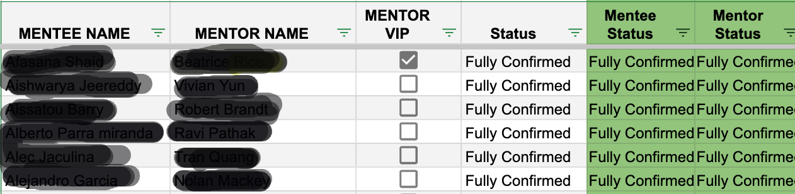
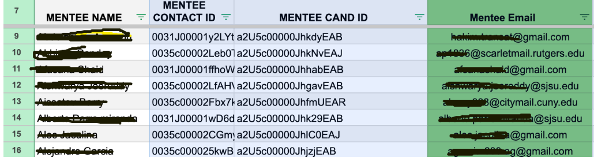
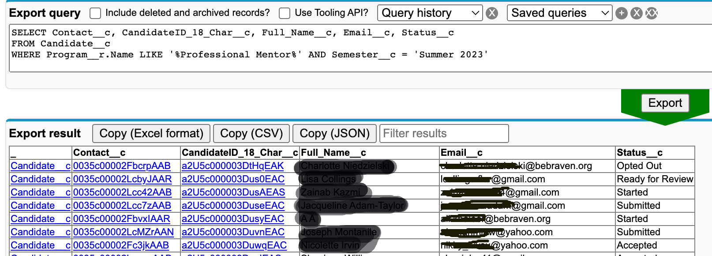

# 1- The Request

My colleague had a google sheet where his team already pulled in data for a category of our volunteers , which are called 'Professional Mentors' (PM's) and their mentees.  These PM's are working professionals who help students navigate the job application process, they are paired with mentees (college students) interested in entering their fields and so are well-positioned to help these mentees find strong first jobs in the field.

The image below gives you a snapshot of what the form looks like, and the columns highlighted green. ** The request from me was to double check confirmation statuses of mentors and mentees and bring their emails into Google sheets.** This involved a few steps:

1. Import those data points (statuses and email addresses) from Salesforce and running an index match in google sheets so that my colleague and his team could comb through that and confirm that what they have in the sheet matches what is in Salesforce AND

2. Also bringing in their contact id's which would be the basis of the index match formula's in google sheets. The logic being that IF the contact id's match, then return the status and the email address

# 2 - SOQL

SOQL is a query language specifically designed for querying data within Salesforce, and because Salesforce is essentially a big data warehouse when you boil it down, using SOQL can sometimes make life easier. I also find the syntax to be more straightforward than SQL, especially after working in Salesforce for sometime and having a better idea of the underlying systems and nuances of salesforce fields and objects.

To query Salesforce, I like to use a tool called Salesforce Inspector seen in the picture below along with the query.it's simple and whenit can, helps correct syntactical errors.

The query below is selecting (grabbing) the contact ID, the candidate ID, the full name and the email as well as the statuses from the Candidate object where all of these data points live.

Because we're looking for candidates of the Professional Mentor program **and the program object and candidate object are related through a master-detail relationship**, we use the "__r" notation to indicate that we are accessing a field on the related object. 

"LIKE '%Professional Mentor%'"  means we're looking for records where the value of the Program__r.Name (i.e. name of the program) field contains "Professional Mentor" anywhere in the text. and Lastly, where the semester field is 'Summer 2023'

# 3- The Result

As you can see in the image above. This query returned the exact data we needed. I also like Salesforce Inspector because it returns the data for immediate inspection and allows for quick export of that data, so I was able to export the CSV to google sheets and run an index match and get that data back to my colleague quickly and he was happy with the outcome.

This result could have also been achieved through a report in Salesforce. If we we're to do this in a Salesforce report, we would have to filter for both record types , mentor and mentee, and also filter for the program name ( containing professional mentor) as well as filtering for the semester (Summer 2023), and then export to a CSV.In this case, running the SOQL query saved time and was fun practice.

# 4 - Data Security
Lastly, a note on Data security. Names and emails were crossed out to prevent exposing any personally identifiable information. contact ID's were not crossed out because even if someone has a contact ID, they would still need appropriate access privileges to our Salesforce org to view or modify the associated records.

Thanks for reading!

